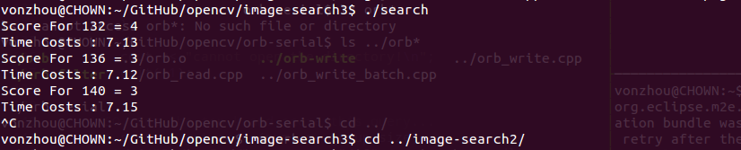
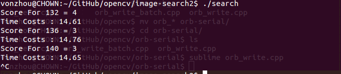

### As [image-serch2], this time the train images's descriptors  are read from the file,(Q: is it faster ?)

### Yes, It is Faster, but My question is : the descriptors computing is not the bottleneck, the matching is. Why This can make it faster ???

### Test It! Compare !

### SO, This time Use 1000 images as the dataset to see how query image size impact the retrieval score!

| Scale Factor   |  Retrieval Score    |  
| --------  | :-----:    |
|1 		|  3.156 | 
|0.95 		|  3.156 | 
|0.9  |  3.30357 | 
|0.8  |  3.14286 | 
| 0.7 | 3.125 |
| 0.6 | 2.85714 |
| 0.5 | 2.80357|
| 0.4 |  2.53571|
| 0.3 | 2.08929|     
| 0.27 | 1.91071 |
| 0.24 | 1.60714 |
| 0.2 |  0.553571 |

