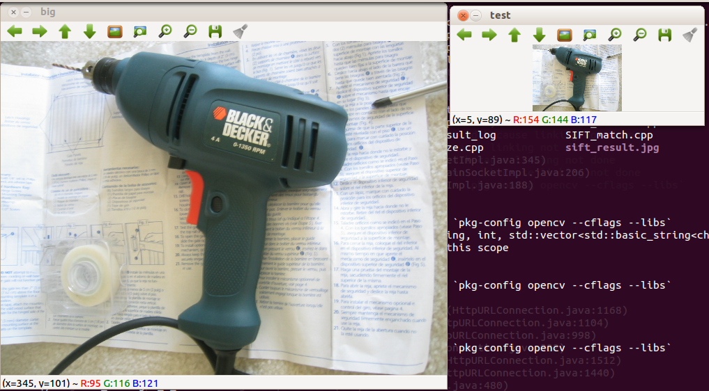

### Use a image in every group as query image, search the dataset and get the score , The image dataset has 56 groups , every group has 4 images.SO, We will see if the retrieved top 4 images is this 4 images, so the possible score is 1,2,3,4.


### Test It! (with different resize scale factor)

g++ -std=c++11 -c orb.cpp `pkg-config opencv --cflags --libs`

g++ -o search main.cpp orb.o `pkg-config opencv --cflags --libs` 

./search 

### Test Results:
| Scale Factor   |  Retrieval Score    |  
| --------  | :-----:    |
|1 		|  3.30357  | 
|0.9  |  3.30357 | 
|0.8  |  3.14286 | 
| 0.7 | 3.125 |
| 0.6 | 2.85714 |
| 0.5 | 2.80357|
| 0.4 |  2.53571|
| 0.3 | 2.08929|     
| 0.27 | 1.91071 |
| 0.24 | 1.60714 |
| 0.2 |  0.553571 |


#### Details are as follows:

### Resize, Scale factor = 1 (original)
```
Score For 132 = 4
Score For 136 = 3
Score For 140 = 3
Score For 144 = 4
Score For 148 = 4
Score For 152 = 4
Score For 156 = 4
Score For 160 = 4
Score For 164 = 3
Score For 168 = 4
Score For 172 = 3 
Score For 176 = 4
Score For 180 = 4
Score For 184 = 4
Score For 188 = 4
Score For 192 = 3
Score For 196 = 1
Score For 200 = 4
Score For 204 = 1
Score For 208 = 4
Score For 212 = 2
Score For 216 = 4
Score For 220 = 3
Score For 224 = 2 
Score For 228 = 4
Score For 232 = 4
Score For 236 = 3
Score For 240 = 4
Score For 244 = 4
Score For 248 = 4
Score For 252 = 2
Score For 256 = 3
Score For 260 = 2
Score For 264 = 4
Score For 268 = 3
Score For 272 = 2
Score For 276 = 4
Score For 280 = 1
Score For 284 = 3
Score For 288 = 4
Score For 292 = 3
Score For 296 = 3 
Score For 300 = 4
Score For 304 = 4
Score For 308 = 4
Score For 312 = 4
Score For 316 = 3
Score For 320 = 3
Score For 324 = 3
Score For 328 = 4
Score For 332 = 3
Score For 336 = 4
Score For 340 = 3
Score For 344 = 4
Score For 348 = 1
Score For 352 = 4 
Average Score For This Dataset: 3.30357
```


### Resize, Scale factor = 0.9
```
Score For 132 = 4
Score For 136 = 4
Score For 140 = 3
Score For 144 = 4
Score For 148 = 4
Score For 152 = 4
Score For 156 = 4
Score For 160 = 4
Score For 164 = 3
Score For 168 = 4
Score For 172 = 3
Score For 176 = 3
Score For 180 = 4
Score For 184 = 4
Score For 188 = 4
Score For 192 = 3
Score For 196 = 2
Score For 200 = 4
Score For 204 = 1
Score For 208 = 4
Score For 212 = 2
Score For 216 = 4
Score For 220 = 3
Score For 224 = 3
Score For 228 = 3
Score For 232 = 4
Score For 236 = 3
Score For 240 = 4
Score For 244 = 3
Score For 248 = 4
Score For 252 = 2
Score For 256 = 3
Score For 260 = 3
Score For 264 = 4
Score For 268 = 3
Score For 272 = 1
Score For 276 = 4
Score For 280 = 1
Score For 284 = 3
Score For 288 = 4
Score For 292 = 2
Score For 296 = 3
Score For 300 = 4
Score For 304 = 4
Score For 308 = 4
Score For 312 = 4
Score For 316 = 4
Score For 320 = 3
Score For 324 = 2
Score For 328 = 4
Score For 332 = 4
Score For 336 = 4
Score For 340 = 4
Score For 344 = 4
Score For 348 = 1
Score For 352 = 3
Average Score For This Dataset: 3.30357
```

### Resize, Scale factor = 0.8
```
Score For 132 = 4
Score For 136 = 4
Score For 140 = 4
Score For 144 = 4
Score For 148 = 4
Score For 152 = 4
Score For 156 = 4
Score For 160 = 4
Score For 164 = 2
Score For 168 = 4
Score For 172 = 4
Score For 176 = 3
Score For 180 = 4
Score For 184 = 4
Score For 188 = 3
Score For 192 = 3
Score For 196 = 1
Score For 200 = 4
Score For 204 = 1
Score For 208 = 3
Score For 212 = 1
Score For 216 = 4
Score For 220 = 3
Score For 224 = 2
Score For 228 = 4
Score For 232 = 4
Score For 236 = 3
Score For 240 = 4
Score For 244 = 4
Score For 248 = 4
Score For 252 = 2
Score For 256 = 2
Score For 260 = 2
Score For 264 = 4
Score For 268 = 3
Score For 272 = 2
Score For 276 = 3
Score For 280 = 1
Score For 284 = 4
Score For 288 = 4
Score For 292 = 1
Score For 296 = 3
Score For 300 = 3
Score For 304 = 4
Score For 308 = 4
Score For 312 = 4
Score For 316 = 3
Score For 320 = 3
Score For 324 = 3
Score For 328 = 4
Score For 332 = 2
Score For 336 = 4
Score For 340 = 4
Score For 344 = 3
Score For 348 = 1
Score For 352 = 2
Average Score For This Dataset: 3.14286
```

### Resize, Scale factor = 0.7
```
Score For 132 = 4
Score For 136 = 3
Score For 140 = 3
Score For 144 = 4
Score For 148 = 4
Score For 152 = 3
Score For 156 = 4
Score For 160 = 4
Score For 164 = 3
Score For 168 = 4
Score For 172 = 3
Score For 176 = 2
Score For 180 = 3
Score For 184 = 4
Score For 188 = 4
Score For 192 = 2
Score For 196 = 1
Score For 200 = 4
Score For 204 = 1
Score For 208 = 3
Score For 212 = 2
Score For 216 = 4
Score For 220 = 3
Score For 224 = 4
Score For 228 = 4
Score For 232 = 4
Score For 236 = 3
Score For 240 = 3
Score For 244 = 4
Score For 248 = 4
Score For 252 = 3
Score For 256 = 3
Score For 260 = 3
Score For 264 = 3
Score For 268 = 2
Score For 272 = 1
Score For 276 = 4
Score For 280 = 1
Score For 284 = 3
Score For 288 = 4
Score For 292 = 1
Score For 296 = 3
Score For 300 = 4
Score For 304 = 4
Score For 308 = 4
Score For 312 = 4
Score For 316 = 4
Score For 320 = 3
Score For 324 = 2
Score For 328 = 4
Score For 332 = 3
Score For 336 = 4
Score For 340 = 4
Score For 344 = 3
Score For 348 = 1
Score For 352 = 2
Average Score For This Dataset: 3.125
```

### Resize, Scale factor = 0.6
```
Score For 132 = 4
Score For 136 = 4
Score For 140 = 3
Score For 144 = 4
Score For 148 = 4
Score For 152 = 3
Score For 156 = 4
Score For 160 = 4
Score For 164 = 1
Score For 168 = 4
Score For 172 = 3
Score For 176 = 2
Score For 180 = 3
Score For 184 = 4
Score For 188 = 4
Score For 192 = 2
Score For 196 = 1
Score For 200 = 4
Score For 204 = 2
Score For 208 = 3
Score For 212 = 2
Score For 216 = 4
Score For 220 = 1
Score For 224 = 2
Score For 228 = 2
Score For 232 = 4
Score For 236 = 3
Score For 240 = 3
Score For 244 = 3
Score For 248 = 4
Score For 252 = 2
Score For 256 = 1
Score For 260 = 3
Score For 264 = 4
Score For 268 = 2
Score For 272 = 1
Score For 276 = 3
Score For 280 = 1
Score For 284 = 3
Score For 288 = 3
Score For 292 = 1
Score For 296 = 3
Score For 300 = 2
Score For 304 = 4
Score For 308 = 4
Score For 312 = 3
Score For 316 = 4
Score For 320 = 3
Score For 324 = 2
Score For 328 = 4
Score For 332 = 3
Score For 336 = 4
Score For 340 = 4
Score For 344 = 3
Score For 348 = 1
Score For 352 = 1
Average Score For This Dataset: 2.85714
```

### Resize, Scale factor = 0.5
```
Score For 132 = 4
Score For 136 = 3
Score For 140 = 3
Score For 144 = 4
Score For 148 = 4
Score For 152 = 3
Score For 156 = 4
Score For 160 = 4
Score For 164 = 1
Score For 168 = 4
Score For 172 = 2
Score For 176 = 2
Score For 180 = 3
Score For 184 = 4
Score For 188 = 3
Score For 192 = 3
Score For 196 = 1
Score For 200 = 4
Score For 204 = 1
Score For 208 = 2
Score For 212 = 1
Score For 216 = 4
Score For 220 = 2
Score For 224 = 2
Score For 228 = 3
Score For 232 = 4
Score For 236 = 3
Score For 240 = 3
Score For 244 = 3
Score For 248 = 4
Score For 252 = 1
Score For 256 = 2
Score For 260 = 3
Score For 264 = 3
Score For 268 = 3
Score For 272 = 1
Score For 276 = 3
Score For 280 = 1
Score For 284 = 3
Score For 288 = 3
Score For 292 = 1
Score For 296 = 3
Score For 300 = 3
Score For 304 = 4
Score For 308 = 4
Score For 312 = 4
Score For 316 = 3
Score For 320 = 3
Score For 324 = 2
Score For 328 = 3
Score For 332 = 3
Score For 336 = 4
Score For 340 = 4
Score For 344 = 2
Score For 348 = 1
Score For 352 = 2
Average Score For This Dataset: 2.80357
```

### Resize, Scale factor = 0.4
```
Score For 132 = 4
Score For 136 = 2
Score For 140 = 3
Score For 144 = 3
Score For 148 = 4
Score For 152 = 3
Score For 156 = 3
Score For 160 = 4
Score For 164 = 1
Score For 168 = 4
Score For 172 = 2
Score For 176 = 2
Score For 180 = 4
Score For 184 = 4
Score For 188 = 3
Score For 192 = 2
Score For 196 = 1
Score For 200 = 3
Score For 204 = 1
Score For 208 = 2
Score For 212 = 2
Score For 216 = 4
Score For 220 = 2
Score For 224 = 2
Score For 228 = 1
Score For 232 = 3
Score For 236 = 3
Score For 240 = 2
Score For 244 = 1
Score For 248 = 4
Score For 252 = 1
Score For 256 = 2
Score For 260 = 2
Score For 264 = 3
Score For 268 = 3
Score For 272 = 1
Score For 276 = 3
Score For 280 = 1
Score For 284 = 3
Score For 288 = 3
Score For 292 = 1
Score For 296 = 2
Score For 300 = 2
Score For 304 = 4
Score For 308 = 4
Score For 312 = 3
Score For 316 = 3
Score For 320 = 3
Score For 324 = 2
Score For 328 = 2
Score For 332 = 3
Score For 336 = 4
Score For 340 = 4
Score For 344 = 2
Score For 348 = 1
Score For 352 = 1
Average Score For This Dataset: 2.53571
```


### Resize, Scale factor = 0.3
```
Score For 132 = 4
Score For 136 = 2
Score For 140 = 3
Score For 144 = 3
Score For 148 = 4
Score For 152 = 3
Score For 156 = 1
Score For 160 = 4
Score For 164 = 1
Score For 168 = 4
Score For 172 = 3
Score For 176 = 1
Score For 180 = 1
Score For 184 = 3
Score For 188 = 2
Score For 192 = 1
Score For 196 = 1
Score For 200 = 3
Score For 204 = 1
Score For 208 = 2
Score For 212 = 2
Score For 216 = 3
Score For 220 = 2
Score For 224 = 1
Score For 228 = 1
Score For 232 = 1
Score For 236 = 2
Score For 240 = 2
Score For 244 = 2
Score For 248 = 3
Score For 252 = 2
Score For 256 = 2
Score For 260 = 2
Score For 264 = 3
Score For 268 = 2
Score For 272 = 1
Score For 276 = 1
Score For 280 = 1
Score For 284 = 3
Score For 288 = 2
Score For 292 = 1
Score For 296 = 1
Score For 300 = 2
Score For 304 = 3
Score For 308 = 4
Score For 312 = 2
Score For 316 = 3
Score For 320 = 1
Score For 324 = 1
Score For 328 = 2
Score For 332 = 1
Score For 336 = 3
Score For 340 = 4
Score For 344 = 2
Score For 348 = 1
Score For 352 = 1
Average Score For This Dataset: 2.08929 
```

### Resize, Scale factor = 0.27
```
Score For 132 = 2
Score For 136 = 2
Score For 140 = 2
Score For 144 = 3
Score For 148 = 4
Score For 152 = 1
Score For 156 = 2
Score For 160 = 3
Score For 164 = 1
Score For 168 = 4
Score For 172 = 1
Score For 176 = 2
Score For 180 = 1
Score For 184 = 3
Score For 188 = 2
Score For 192 = 1
Score For 196 = 1
Score For 200 = 3
Score For 204 = 1
Score For 208 = 1
Score For 212 = 1
Score For 216 = 3
Score For 220 = 1
Score For 224 = 1
Score For 228 = 1
Score For 232 = 1
Score For 236 = 2
Score For 240 = 3
Score For 244 = 1
Score For 248 = 2
Score For 252 = 1
Score For 256 = 2
Score For 260 = 3
Score For 264 = 3
Score For 268 = 2
Score For 272 = 1
Score For 276 = 1
Score For 280 = 1
Score For 284 = 3
Score For 288 = 1
Score For 292 = 1
Score For 296 = 2
Score For 300 = 1
Score For 304 = 4
Score For 308 = 4
Score For 312 = 1
Score For 316 = 2
Score For 320 = 2
Score For 324 = 1
Score For 328 = 3
Score For 332 = 2
Score For 336 = 3
Score For 340 = 4
Score For 344 = 1
Score For 348 = 1
Score For 352 = 1
Average Score For This Dataset: 1.91071 
```


### Resize, Scale factor = 0.24
```
Score For 132 = 1
Score For 136 = 1
Score For 140 = 2
Score For 144 = 2
Score For 148 = 3
Score For 152 = 0
Score For 156 = 1
Score For 160 = 3
Score For 164 = 1
Score For 168 = 3
Score For 172 = 1
Score For 176 = 1
Score For 180 = 1
Score For 184 = 2
Score For 188 = 1
Score For 192 = 2
Score For 196 = 1
Score For 200 = 3
Score For 204 = 1
Score For 208 = 2
Score For 212 = 1
Score For 216 = 3
Score For 220 = 1
Score For 224 = 2
Score For 228 = 1
Score For 232 = 1
Score For 236 = 2
Score For 240 = 1
Score For 244 = 1
Score For 248 = 1
Score For 252 = 1
Score For 256 = 1
Score For 260 = 3
Score For 264 = 3
Score For 268 = 2
Score For 272 = 1
Score For 276 = 1
Score For 280 = 1
Score For 284 = 2
Score For 288 = 1
Score For 292 = 1
Score For 296 = 1
Score For 300 = 1
Score For 304 = 3
Score For 308 = 4
Score For 312 = 1
Score For 316 = 3
Score For 320 = 1
Score For 324 = 1
Score For 328 = 1
Score For 332 = 1
Score For 336 = 3
Score For 340 = 4
Score For 344 = 1
Score For 348 = 1
Score For 352 = 1
Average Score For This Dataset: 1.60714
```


### Resize, Scale factor = 0.2
```
Score For 132 = 0
Score For 136 = 0
Score For 140 = 0
Score For 144 = 1
Score For 148 = 1
Score For 152 = 0
Score For 156 = 0
Score For 160 = 0
Score For 164 = 0
Score For 168 = 1
Score For 172 = 1
Score For 176 = 2
Score For 180 = 0
Score For 184 = 0
Score For 188 = 1
Score For 192 = 0
Score For 196 = 1
Score For 200 = 0
Score For 204 = 1
Score For 208 = 1
Score For 212 = 0
Score For 216 = 2
Score For 220 = 0
Score For 224 = 1
Score For 228 = 0
Score For 232 = 0
Score For 236 = 0
Score For 240 = 0
Score For 244 = 1
Score For 248 = 0
Score For 252 = 0
Score For 256 = 1
Score For 260 = 0
Score For 264 = 1
Score For 268 = 0
Score For 272 = 0
Score For 276 = 0
Score For 280 = 0
Score For 284 = 1
Score For 288 = 1
Score For 292 = 2
Score For 296 = 0
Score For 300 = 0
Score For 304 = 1
Score For 308 = 2
Score For 312 = 1
Score For 316 = 1
Score For 320 = 0
Score For 324 = 0
Score For 328 = 1
Score For 332 = 0
Score For 336 = 2
Score For 340 = 3
Score For 344 = 0
Score For 348 = 0
Score For 352 = 0
Average Score For This Dataset: 0.553571
```


### What is the concept of resize the query image to XXX ?

factor=0.5

factor =0.3


factor=0.2

